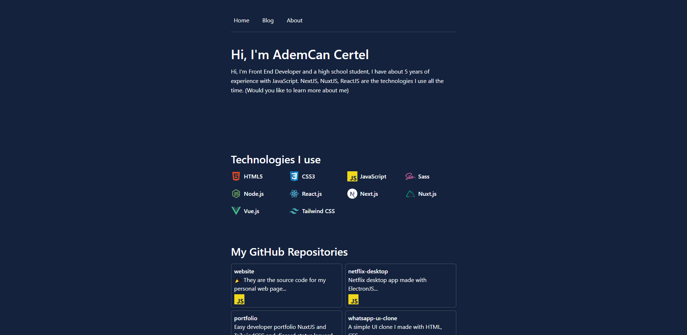

# ✨ My personal site
    

# 🧱 Getting Started
    * First of all clone the project to your device `git clone https://github.com/AdemCanCertel/website.git`

    * Download the project
        * npm i 
    * You can run the project in developer Mode.
        * npm run dev
    * Steps to compile the project
        * npm run generate
        * npm run build

[Next.js Docs](https://nextjs.org/docs)

# Thanks
[Tailwind CSS](https://tailwindcss.com/)

    